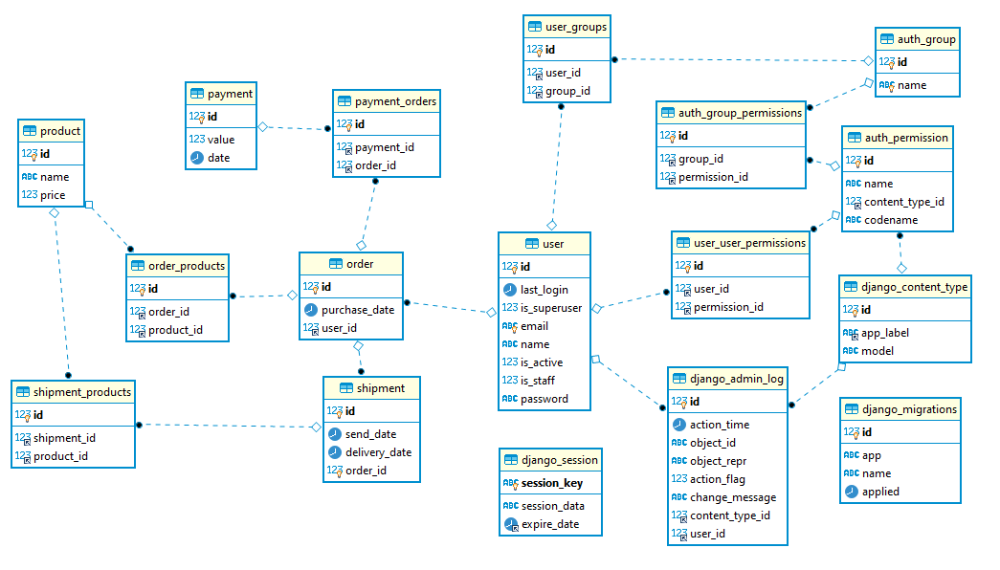

# Prueba OmniLatam

## Descripción
El reto consiste en crear una api donde se pueda ralizar el flujo basico de un e-commerce.

## Implementación

La solucion se desarrolló  utilizando las siguientes herramientas:
- Python 3.8.
- Django=3.2.5
- djangorestframework=3.12.4
- Postgres 11 .


## Ejecución

Para iniciar el servicio se base de datos y de la aplicación se  debe ejecutar :
```
docker-compose up -d
```
Los servicios serán expuestos y se podrán ver por medio de Swagger en la url :

http://127.0.0.1:8000/api/schema/swagger-ui/


## Modelo ER

El modelo ER creado  para la solución es el siguiente :

<p align="center"> 
  
</p>

## Coverage

Para realizar el coverage se utilizó covergage.py , obteniendo un porcentage del 92%
La información sobre el coverage puede ser encontrada en la carpeta [acá](htmlcov)


